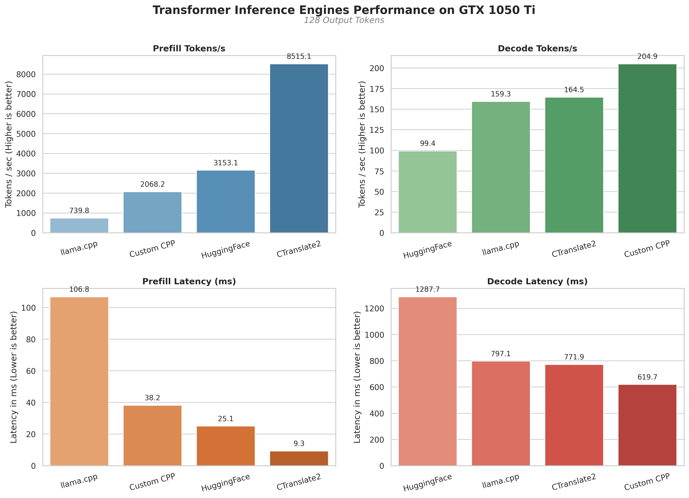
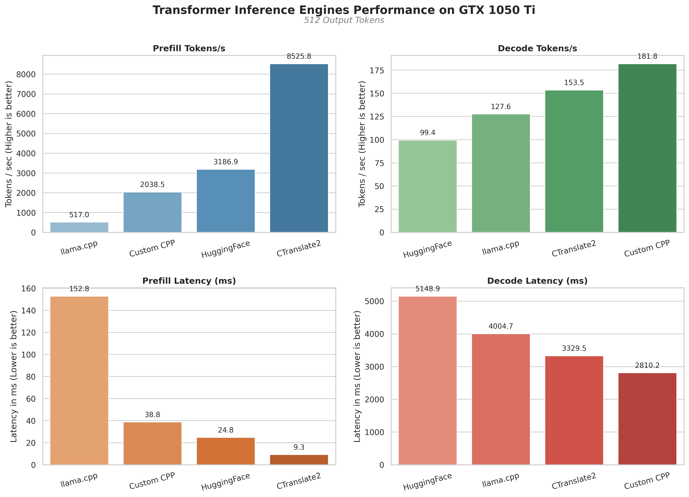

# Transformer Inference Engine 

A from-scratch GPT-2 inference engine written in C++/CUDA, purpose-built to maximize token throughput on a **single NVIDIA GTX 1050 Ti** (4GB VRAM, 768 CUDA cores, Pascal SM 6.1).

**Goal:** Beat vLLM and standard inference libraries on next-token prediction latency and throughput for GPT-2 (124M) — on consumer-grade hardware that the big frameworks ignore.

## Why This Exists

Production inference frameworks (vLLM, TensorRT-LLM, etc.) are designed for data-center GPUs with 40-80GB of VRAM. They carry overhead — Python runtime, generic kernels, PagedAttention for multi-tenant serving — that makes no sense on a 4GB card.

This engine takes the opposite approach: every CUDA kernel, every memory allocation, and every architectural decision is hand-tuned for the constraints of a GTX 1050 Ti. No framework overhead. No Python in the hot path. Just C++ and raw CUDA.

## Current Performance

**GPU:** NVIDIA GeForce GTX 1050 Ti (4040 MB VRAM, 6 SMs, Compute Capability 6.1)
**Model:** GPT-2 Small (124M parameters, 12 layers, 768 dim, 12 heads)

| Metric | Current |
|---|---|
| **Prefill Throughput** | ~2,068 tok/s |
| **Decode Throughput** | ~205 tok/s |
| **TTFT (79 tokens)** | ~38 ms |
| **Decode Latency (128 tokens)** | ~620 ms |
| **Weight Memory** | ~311 MB (FP16) |
| **KV Cache Memory** | 72 MB (12 layers) |
| **Scratch Memory** | 1136 MB |
 
> These numbers are from the built-in benchmark suite running a 79-token prompt generating 128 tokens (May 21, 2026). Weights are stored in FP16 and computed in FP32 (mixed-precision), halving weight memory bandwidth. Decode uses a contiguous KV cache — only the new token is projected and attended against cached K/V history each step, giving O(N) per-step compute instead of O(N²).

### GEMM Kernel Performance

The GEMM kernel uses **register tiling** (64×64 block tile, 8×8 thread tile per thread) to maximize arithmetic intensity. Benchmark results on real transformer shapes:

| Case | GFLOP/s | vs cuBLAS | vs Peak |
|---|---|---|---|
| FF Up (79×3072×768) | 592 | 53.8% | 20.2% |
| FF Down (79×768×3072) | 537 | 48.6% | 18.3% |
| QKV Projection (79×768×768) | 509 | 57.9% | 17.3% |
| Square 1024×1024 | 979 | 57.7% | 33.3% |

### Multi-Engine Comparison

Below is the latest performance comparison between this Custom C++ engine, HuggingFace, llama.cpp, and CTranslate2 running the same 79-token prompt on the GTX 1050 Ti:



*128 output tokens — Custom C++ engine leads decode throughput at 205 tok/s, 1.25× faster than CTranslate2 and 2.1× faster than HuggingFace.*



*512 output tokens — Custom C++ engine sustains 182 tok/s decode, 1.18× faster than CTranslate2 and 1.83× faster than HuggingFace. Date: May 21, 2026 (FP16 weight quantization).*

## Architecture

```
┌──────────────────────────────────────────────────────────────┐
│                    Client Code (main.cpp)                     │
│                  Submits prompts, reads results               │
└──────────────────────┬───────────────────────────────────────┘
                       │
                       ▼
┌──────────────────────────────────────────────────────────────┐
│              BatchExecutorOrchestrator                        │
│  Owns: Transformer model, weights arena, tokenizer           │
│  Creates BatchExecutors per request with isolated memory     │
└──────────────────────┬───────────────────────────────────────┘
                       │
                       ▼
┌──────────────────────────────────────────────────────────────┐
│                    BatchExecutor                              │
│  Owns: CUDA stream, scratch memory arena                     │
│  Delegates to: ExecutionStrategy (via polymorphism)           │
└──────────────────────┬───────────────────────────────────────┘
                       │
                       ▼
┌──────────────────────────────────────────────────────────────┐
│              ExecutionStrategy (Template Method)              │
│                                                              │
│  generate() {                                                │
│      prefill_time = time( run_prefill() )  ← defined once    │
│      decode_time  = time( run_decode()  )  ← defined once    │
│      compute metrics (tok/s, latency)      ← defined once    │
│  }                                                           │
│                                                              │
│  Concrete strategies only implement:                         │
│    run_prefill()  — process prompt, emit first token          │
│    run_decode()   — autoregressive token generation loop      │
│    finalize()     — detokenization                            │
└──────────────────────┬───────────────────────────────────────┘
                       │
              ┌────────┴──────────┐
              ▼                   ▼
     SingleDeviceStrategy   (Future: MultiDeviceStrategy,
     (current impl)         FusedKernelStrategy, ...)
```

### Key Design Decisions

- **Arena-based GPU memory management** — Pre-allocates bulk GPU memory and sub-allocates from it. No `cudaMalloc` in the hot path. Scratch memory is reset per-token via offset tracking.
- **Strategy pattern for execution** — The `ExecutionStrategy` base class enforces consistent metric definitions (what "prefill time" and "decode time" mean) across all strategies via the Template Method pattern. New strategies implement execution logic; the framework handles timing.
- **Stream-per-executor isolation** — Each `BatchExecutor` gets its own CUDA stream and memory arena, enabling concurrent execution without resource conflicts.
- **All custom CUDA kernels** — No cuBLAS, no cuDNN. Every kernel (GEMM, GEMV, softmax, LayerNorm, attention, GELU, argmax) is hand-written and tuned for this GPU's constraints.
- **FP16 weight storage** — All projection weights stored in half-precision, halving VRAM bandwidth during decode. Computation remains in FP32 for numerical stability.

## Project Structure

```
├── include/
│   ├── pipeline/
│   │   ├── execution_strategy.hpp  # Abstract base — Template Method pattern
│   │   ├── single_device_strategy.hpp  # Current execution strategy
│   │   └── metrics.hpp             # GenerationMetrics, GenerationResult, GenerationConfig
│   ├── layers/
│   │   ├── layer.h                 # Abstract Layer base (Template Method for profiling)
│   │   ├── transformer.h           # Transformer, TransformerBlock, LayerNorm, FeedForward
│   │   └── attention.h             # Multi-head self-attention
│   ├── kv_cache/
│   │   ├── kv_cache.h              # IKVCache interface + KVCacheFactory
│   │   └── contiguous_kv_cache.h   # Contiguous layout strategy
│   ├── batch_executor.hpp          # Per-batch execution context (stream + memory)
│   ├── batch_executor_orchestrator.hpp  # Top-level API — model + weight lifecycle
│   ├── kernels.cuh                 # All CUDA kernel declarations
│   ├── memory.h                    # GPUMemoryArena (bump allocator)
│   ├── tokenizer.h                 # BPE tokenizer (GPT-2 compatible)
│   └── model_config.hpp            # Hyperparameter struct
├── src/
│   ├── kernels/                    # CUDA kernel implementations
│   │   ├── gemm.cu                 #   Register-tiled GEMM (64×64 block, 8×8 thread tile)
│   │   ├── batched_gemm.cu         #   Batched GEMM (attention scores)
│   │   ├── softmax.cu              #   Numerically stable softmax
│   │   ├── layernorm.cu            #   Warp-intrinsic LayerNorm
│   │   ├── embedding.cu            #   Token + positional embedding lookup
│   │   ├── activation.cu           #   Fused bias + GELU
│   │   ├── sampling.cu             #   Argmax (greedy decoding)
│   │   ├── transpose.cu            #   Matrix transpose
│   │   ├── addition.cu             #   Element-wise addition (residuals)
│   │   ├── cache_append.cu         #   KV cache append (scatter-copy per head)
│   │   ├── cache_gather.cu         #   KV cache gather (reconstruct flat layout)
│   │   └── ...
│   ├── layers/                     # C++ layer implementations
│   │   ├── attention.cpp           #   Multi-head attention orchestration
│   │   ├── feed_forward.cpp        #   FFN (up-proj → GELU → down-proj)
│   │   ├── layer_norm.cpp          #   LayerNorm wrapper
│   │   └── transformer_block.cpp   #   Pre-norm transformer block
│   ├── kv_cache/
│   │   └── contiguous_kv_cache.cu  #   Contiguous KV cache implementation
│   ├── pipeline/
│   │   └── single_device_strategy.cpp  # SingleDeviceStrategy implementation
│   ├── transformer.cpp             # Full forward pass orchestration
│   ├── batch_executor.cpp          # BatchExecutor implementation
│   ├── batch_executor_orchestrator.cpp
│   ├── tokenizer.cpp               # BPE encode/decode
│   ├── memory.cpp                  # GPU arena allocator
│   └── main.cpp                    # CLI entry point
├── tests/
│   ├── bench_performance.cu        # Full benchmark suite (kernels + pipeline)
│   ├── test_transformer.cu         # End-to-end transformer correctness
│   ├── test_attention.cu           # Attention layer tests
│   ├── test_feed_forward.cu        # FFN tests
│   ├── test_gemm.cu                # GEMM correctness
│   └── ...                         # Per-kernel unit tests
├── tools/
│   ├── gpt2_exporter.py            # Export HuggingFace GPT-2 weights to binary
│   ├── hf_baseline.py              # HuggingFace reference for comparison
│   ├── plot_benchmarks.py          # Generate comparison dashboard chart
│   └── ...                         # Debug/validation scripts
├── docs/
│   └── performance_testing/        # Timestamped benchmark reports (CSV + summary)
├── dataset/
│   ├── input/                      # Benchmark prompt files
│   └── output/                     # Generated text per run
└── CMakeLists.txt
```

## Building

### Prerequisites

- CUDA Toolkit (tested with CUDA 12.x)
- CMake ≥ 3.18
- C++17 compiler
- NVIDIA GPU with Compute Capability ≥ 6.1

### Setup

```bash
# 1. Clone and enter
git clone <repo-url>
cd transformer_inference_engine

# 2. Export GPT-2 weights (requires Python + transformers)
python tools/gpt2_exporter.py

# 3. Build
mkdir -p build && cd build
cmake -DCMAKE_CUDA_ARCHITECTURES=61 ..
make -j$(nproc)
```

### Run

```bash
# Run inference
./gpt2_engine

# Run full benchmark suite
./bench_performance

# Run individual tests
./test_transformer
./test_attention
./test_gemm
# ... etc
```

### Example Output

```
>>> Initializing Engine...
>>> Starting Inference: 'Alan Turing was a' ...
[KVCache] Allocated ContiguousKVCache: 72 MB for 12 layers
 brilliant mathematician, and he was a great friend of mine.

--- Performance Metrics ---
Prefill Time:  36.16 ms (2185 tok/s)
Decode Time:   840.92 ms (151.0 tok/s) for 128 tokens
Total Time:    877.08 ms
```

## Benchmark Suite

The benchmark (`tests/bench_performance.cu`) runs two tiers:

1. **Kernel-level** — Isolated timing of individual CUDA kernels (embedding lookup, GEMM, attention QK, softmax, LayerNorm) across different sequence lengths.
2. **Pipeline-level** — End-to-end generation from real text prompts with prefill/decode throughput measurement.

Reports are saved to `docs/performance_testing/run_<timestamp>/` as CSV + human-readable summary.

```bash
# Run benchmarks
cd build && ./bench_performance

# View latest report
cat docs/performance_testing/run_*/summary_*.txt
```

## Roadmap

Key optimizations planned and completed:

- [x] **Register-Tiled GEMM** — 3× speedup over textbook shared-memory tiling by having each thread compute an 8×8 sub-tile in registers (achieving ~58% of cuBLAS on square matrices).
- [x] **KV Cache** — Contiguous KV cache with O(N) decode. Decode throughput improved from ~21 tok/s to ~50 tok/s (2.4× speedup). Each decode step projects only the new token and attends against cached K/V history.
- [x] **GEMV M=1 Dispatch** — Replaced generic tiled GEMM with specialized GEMV kernels for single-token decode steps. Decode throughput improved from ~50 tok/s to ~151 tok/s (3× speedup).
- [x] **FP16 Weight Quantization** — Weights stored in FP16, computed in FP32 (mixed-precision). Halves weight memory from ~622 MB to ~311 MB and cuts memory bandwidth during decode. Decode throughput improved from ~151 tok/s to ~205 tok/s (1.36× speedup).
- [ ] **Fused Decode Attention Kernel** — Replace the current gather + transpose + batched-GEMM decode path with a single fused kernel that reads directly from cache layout, eliminating intermediate memory traffic.
- [ ] **Kernel Fusion** — Fuse LayerNorm + QKV projection, bias + GELU, and other adjacent operations to reduce memory bandwidth pressure and kernel launch overhead.
- [ ] **Memory-Efficient Attention** — Reduce the O(S²) attention memory footprint to enable longer sequences within 4GB VRAM.
- [ ] **INT8 Quantization** — Further reduce memory usage with 8-bit integer weights.
- [ ] **CUDA Graphs** — Capture the decode loop as a graph to eliminate per-step kernel launch overhead.

## License

This project is for educational and research purposes.
