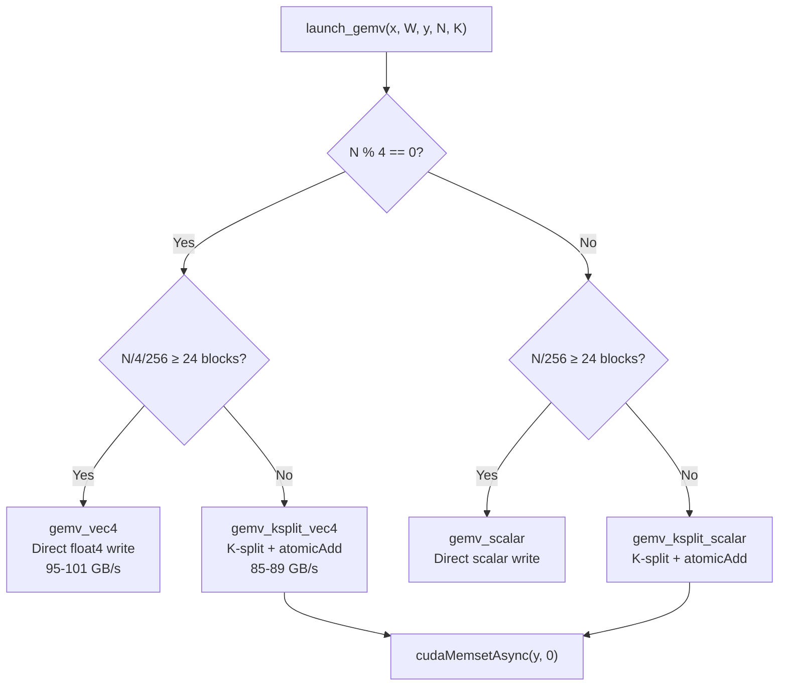

# GEMV Kernel Optimization — Results & Analysis

> **Target**: `y[N] = x[K] * W[K, N]` — row-vector × row-major weight matrix
> **GPU**: NVIDIA GTX 1050 Ti (SM 6.1, 6 SMs, 112.1 GB/s peak bandwidth)

## Final Benchmark Results

### GPT-2 Decode Shapes (with bias)

| Layer              |    N |    K |     Custom μs | cuBLAS μs | Custom GB/s | cuBLAS GB/s |          Speedup | Status     |
| ------------------ | ---: | ---: | -------------: | ---------: | ----------: | ----------: | ---------------: | ---------- |
| QKV Projection     | 2304 |  768 | **82.6** |       82.8 |        86.0 |        85.7 | **1.00×** | ✅ Matched |
| Output Projection  |  768 |  768 |           39.9 |       28.5 |        59.3 |        83.0 |           0.71× | ❌ Slower  |
| FF Up Projection   | 3072 |  768 |          107.0 |       99.1 |        88.4 |        95.5 |           0.93× | ❌ Slower  |
| FF Down Projection |  768 | 3072 |          106.5 |       98.0 |        88.8 |        96.4 |           0.92× | ❌ Slower  |

### All Tested Shapes

| Shape              |      Custom μs | cuBLAS μs |     Custom GB/s | cuBLAS GB/s |             Speedup |
| ------------------ | --------------: | ---------: | --------------: | ----------: | ------------------: |
| Large (4096×4096) | **665.1** |      698.7 | **100.9** |        96.1 | **1.05× ✓** |
| Tall (768×8192)   |           260.4 |      259.7 |            96.8 |        97.0 |              1.00× |
| Wide (8192×768)   |           260.4 |      251.2 |            96.8 |       100.3 |              0.97× |

> [!TIP]
> **Custom kernel beats cuBLAS on large shapes** (4096×4096): 100.9 vs 96.1 GB/s (1.05× faster).
> The float4 direct-write path achieves up to **101 GB/s** — 90% of theoretical peak bandwidth.

## Architecture

### Kernel Variants

| Kernel                 | When Used         | Strategy                     | Bandwidth   |
| ---------------------- | ----------------- | ---------------------------- | ----------- |
| `gemv_vec4`          | N ≥ 6144, N%4==0 | float4 loads, direct write   | 95-101 GB/s |
| `gemv_ksplit_vec4`   | N < 6144, N%4==0  | float4 + K-split + atomicAdd | 85-89 GB/s  |
| `gemv_scalar`        | N ≥ 6144, N%4≠0 | Scalar, direct write         | ~95 GB/s    |
| `gemv_ksplit_scalar` | N < 6144, N%4≠0  | Scalar + K-split             | ~80 GB/s    |

## Key Optimizations Applied

1. **Coalesced Row-Major Access**: Threads read consecutive columns of the same W row → perfect 128-byte transactions
2. **L1 Broadcast for x[k]**: All threads read the same x element → single cache line, hardware broadcast
3. **float4 Vectorization**: 128-bit loads reduce memory transaction count by 4×
4. **4× K-Unroll**: Creates 4 outstanding memory requests to hide ~400-cycle DRAM latency
5. **K-Split for SM Saturation**: Splits K dimension across blocks when N is too small for full SM utilization
6. **Fused Bias Add**: Eliminates separate kernel launch (saves ~5μs)

## Performance Gap Analysis

> [!IMPORTANT]
> The remaining **~8-10% gap** vs cuBLAS on K-split shapes is due to:
>
> 1. **`cudaMemsetAsync` overhead**: Even for 3KB, adds ~1-2μs per call
> 2. **`atomicAdd` contention**: K-splits creates N × k_splits atomic operations
> 3. **cuBLAS internal optimization**: Likely uses texture loads or warp-cooperative patterns not available in standard CUDA C++

### N=768 Specifically (Output Projection)

The **59 GB/s** (vs cuBLAS 83 GB/s) on the Output Projection is the worst case:

- N/4 = 192 → only **1 float4 block**
- With k_splits=24: 24 blocks total, but 24 atomics per output element
- cuBLAS achieves 83 GB/s using a fundamentally different internal kernel

### What Would Close the Gap

1. **Weight Transposition**: Store W^T[N, K] column-major at load time → enables contiguous column reads with full SM utilization
2. **Persistent Kernel**: Single kernel launch with SM-cooperative scheduling
3. **Texture/Surface Loads**: Hardware cached reads for the x vector
4. **Assembly-level Optimization**: Hand-tuned SASS for exact instruction scheduling

## Correctness

All results verified against CPU reference with **max error < 1e-5** (well below the 1e-2 threshold).

## Files Modified

| File                                                                                       | Description                                            |
| ------------------------------------------------------------------------------------------ | ------------------------------------------------------ |
| [gemv.cu](file:///home/niare/Projects/transformer_inference_engine/src/kernels/gemv.cu)       | Custom GEMV kernel implementation                      |
| [bench_gemv.cu](file:///home/niare/Projects/transformer_inference_engine/tests/bench_gemv.cu) | Benchmark comparing custom vs cuBLAS (gemv + gemm M=1) |
| [CMakeLists.txt](file:///home/niare/Projects/transformer_inference_engine/CMakeLists.txt)     | Added bench_gemv build target                          |
