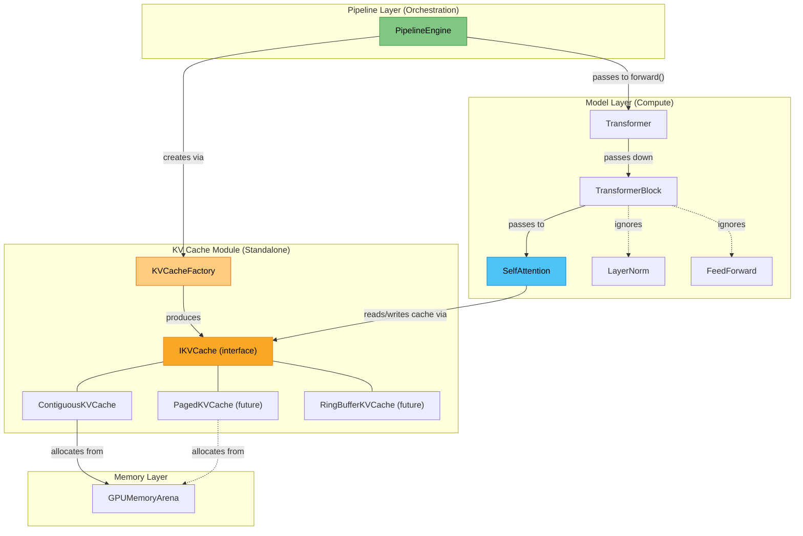
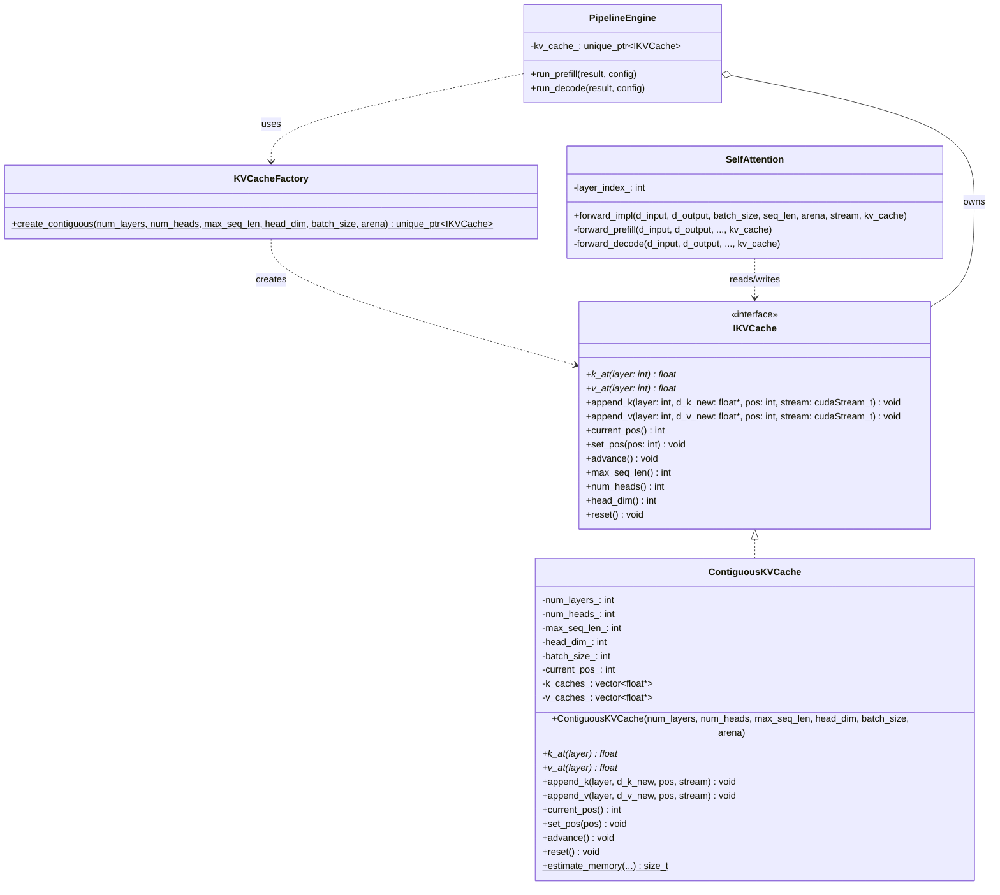
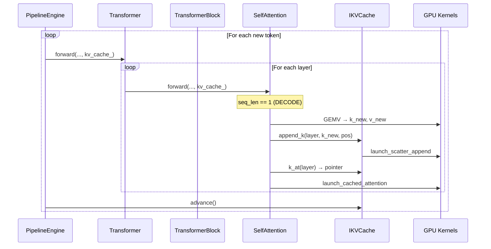

# KV Cache Module — Low-Level Design

## 1. Module Boundary & Ownership

The KV cache is a **standalone module** under `include/kv_cache/` and `src/kv_cache/`. The pipeline engine is a *consumer*, not an *owner* of the cache logic.



---

## 2. Class Hierarchy



---

## 3. Interface Definition

> [!NOTE]
> **Why the `I` prefix?** `IKVCache` — the `I` stands for **Interface**. This is a common C++ naming convention to distinguish abstract interfaces from concrete classes. When you see `IKVCache`, read it as "the KV Cache Interface." The concrete implementation is `ContiguousKVCache` (no `I` prefix).

```cpp
// include/kv_cache/kv_cache.h

class IKVCache {
public:
    virtual ~IKVCache() = default;

    // --- Per-layer access (Layout Agnostic) ---
    
    // Returns a pointer to the start of the cache for a layer.
    // SelfAttention uses this to read cached values for the attention GEMM.
    virtual float* k_at(int layer) = 0;
    virtual float* v_at(int layer) = 0;

    // Strategies implement the actual write logic (e.g. scattering heads).
    // d_kv_new is expected to be [batch, num_heads, 1, head_dim]
    virtual void append_k(int layer, const float* d_k_new, int pos, cudaStream_t stream) = 0;
    virtual void append_v(int layer, const float* d_v_new, int pos, cudaStream_t stream) = 0;

    // --- Position tracking ---
    virtual int  current_pos() const = 0;  // Number of filled positions
    virtual void set_pos(int pos) = 0;     // Set after prefill
    virtual void advance() = 0;            // current_pos++ after each decode step

    // --- Metadata ---
    virtual int num_layers() const = 0;
    virtual int num_heads() const = 0;
    virtual int head_dim() const = 0;
    virtual int max_seq_len() const = 0;

    // --- Lifecycle ---
    virtual void reset() = 0;              // Clear cache for new generation
};
```

> [!NOTE]
> **What does `= 0` mean?** Setting a virtual method `= 0` makes it **pure virtual** — it means "this class does NOT provide an implementation; any subclass MUST implement this method." It also makes `IKVCache` an **abstract class** — you cannot do `new IKVCache()`. You can only create concrete implementations like `new ContiguousKVCache(...)`.

### What does "position" mean?

**Position = how many sequence tokens have been written into the cache so far.** Think of it as a write cursor.

```
Prompt: "Alan Turing was a"  →  tokens [36235, 39141, 373, 257]

After prefill:  current_pos = 4   (K,V for tokens 0,1,2,3 are cached)
After decode 1: current_pos = 5   (K,V for token 4 appended)
...
After decode N: current_pos = 4+N
```

The position tells SelfAttention: "when doing attention, only look at cache entries `[0..current_pos-1]`, the rest is uninitialized."

---

## 4. File Layout

```
include/
├── kv_cache/
│   ├── kv_cache.h              ← IKVCache interface + KVCacheFactory
│   └── contiguous_kv_cache.h   ← ContiguousKVCache declaration
├── layers/
│   ├── layer.h                 ← forward_impl gains IKVCache* param
│   ├── attention.h             ← gains layer_index_, decode/prefill split
│   └── transformer.h           ← threads IKVCache* through
└── pipeline/
    └── pipeline_engine.hpp     ← owns unique_ptr<IKVCache>, uses factory

src/
├── kv_cache/
│   └── contiguous_kv_cache.cpp ← ContiguousKVCache implementation
├── layers/
│   ├── attention.cpp           ← prefill/decode branch logic
└── pipeline/
    └── pipeline_engine.cpp     ← creates cache via factory, passes down
```

---

## 5. How SelfAttention Stays Strategy-Agnostic

SelfAttention never performs manual pointer arithmetic to find a head's offset. It delegates this to the `IKVCache` implementation.

```cpp
void SelfAttention::forward_decode(..., IKVCache* kv_cache) {
    // 1. Projections (GEMV)
    // d_k_new, d_v_new are [num_heads, head_dim]
    
    // 2. Append to Cache
    // The CACHE handles the layout-specific scatter-copy
    kv_cache->append_k(layer_index_, d_k_new, kv_cache->current_pos(), stream);
    kv_cache->append_v(layer_index_, d_v_new, kv_cache->current_pos(), stream);

    // 3. Attention
    // Get base pointer for the layer. Math inside kernels will respect 
    // the layout contract defined by the specific IKVCache implementation.
    float* k_base = kv_cache->k_at(layer_index_);
    float* v_base = kv_cache->v_at(layer_index_);
    
    int total_tokens = kv_cache->current_pos() + 1;
    
    // Launch batched kernel that attends [1, hd] against [total_tokens, hd]
    kernels::launch_cached_attention(..., k_base, v_base, total_tokens, ...);
}
```

---

## 6. Memory Layout (Contiguous Strategy)

Let's trace through a concrete example with GPT-2 Small.
- `num_heads = 12`, `max_seq_len = 1024`, `head_dim = 64`
- 12 heads per layer = **3 MB per layer for K** (same for V)

**K cache for layer 0 — Layout Contract:**
The `ContiguousKVCache` implements the layout: `[num_heads, max_seq_len, head_dim]`.

```
  k_at(0) points here
  ↓
  ┌─── Head 0 ──────────────────────────────────────────────────────┐
  │ pos 0: [64 f] │ pos 1: [64 f] │ ... │ pos 1023: [64 f]         │
  ├─── Head 1 ──────────────────────────────────────────────────────┤
  │ pos 0: [64 f] │ pos 1: [64 f] │ ... │ pos 1023: [64 f]         │
  ├─── ... ─────────────────────────────────────────────────────────┤
```

**Index Math (Hidden inside ContiguousKVCache):**
When `append_k` is called, it launches a kernel that copies head `h` to `base + h * max_seq_len * head_dim + current_pos * head_dim`.

If you change to a different layout (e.g. `[max_seq_len, num_heads, head_dim]`) in a new strategy, you only change the `IKVCache` implementation and the specific attention kernel it pairs with. `SelfAttention` remains identical.

---

## 7. Memory Layout (Inference Arena)

```
┌─────────────────────────────────────────────────────────────────────┐
│                        Inference Arena                              │
├─────────────────┬──────────────────────────┬────────────────────────┤
│  Persistent I/O │      KV Cache Block      │   Scratch (per-step)   │
│  ─────────────  │  ────────────────────────  │  ──────────────────── │
│  d_input_ids    │  Layer 0: K [H,S,D]      │  Q, K_new, V_new      │
│  d_logits       │  Layer 0: V [H,S,D]      │  attention scores      │
│  d_next_tokens  │  ...                      │  ...                  │
├─────────────────┼──────────────────────────┼────────────────────────┤
│ ~0.8 MB         │ ~72 MB (persistent)      │  ~small (seq_len=1)    │
└─────────────────┴──────────────────────────┴────────────────────────┘
```

The KV cache block is allocated **once** and survives the `reset_to(persistent_offset)` calls between decode steps.

---

## 8. Data Flow — Decode Phase


